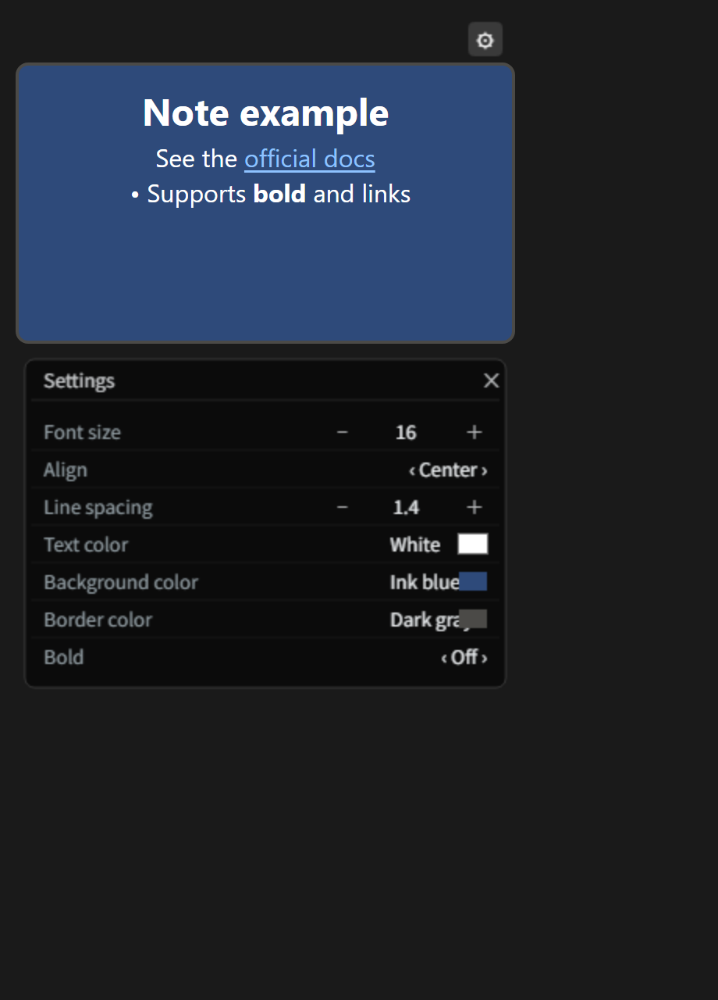
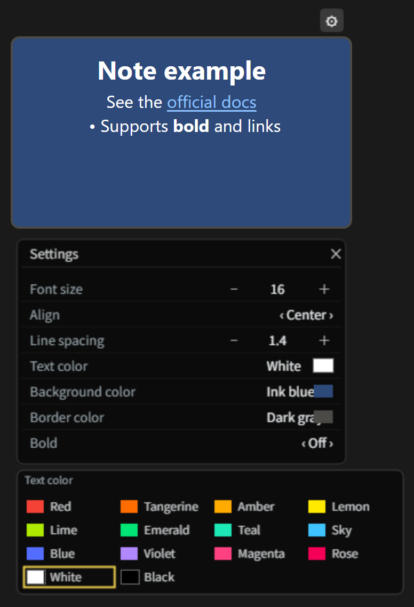
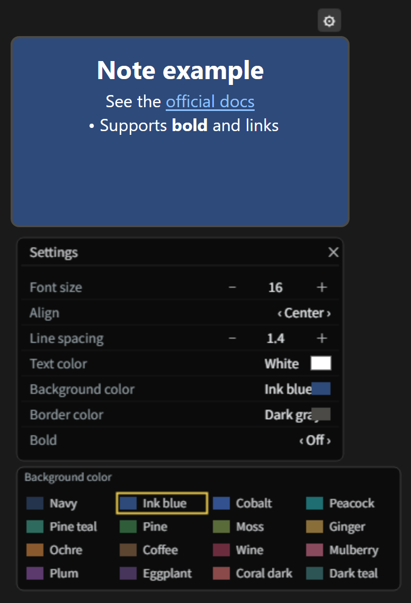
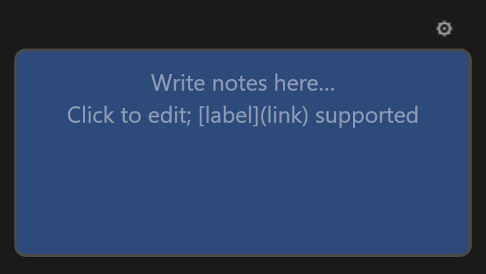
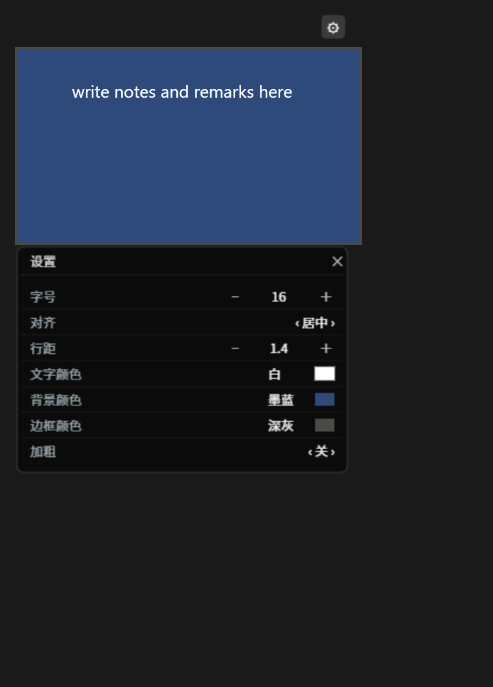
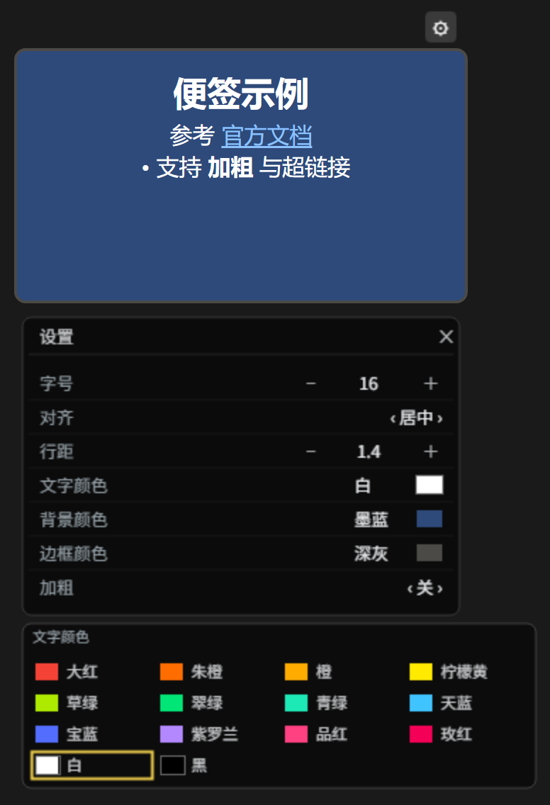
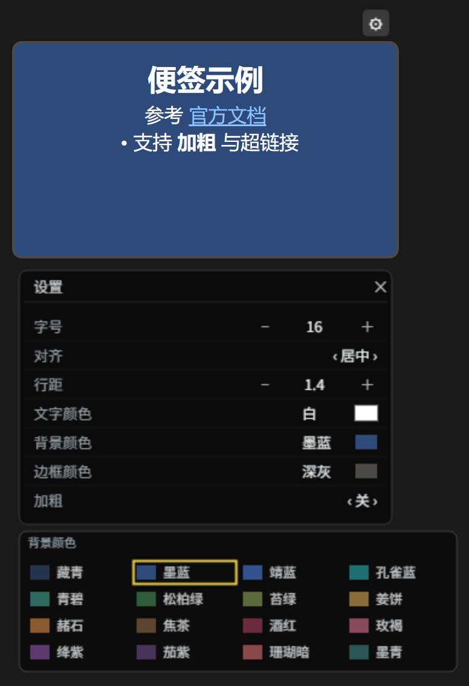
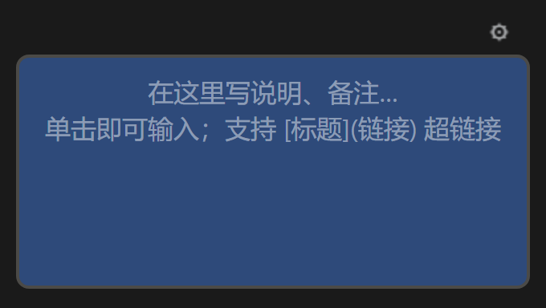

# ComfyUI-TextNote

📝 Canvas sticky-note node for ComfyUI — write text notes / annotations next to your nodes. Like the built-in *Note* node, but fully styleable.

**中文说明见下方 / [中文说明](#中文说明)**

  

|  |  |
|---|---|
| **Settings panel** | **Text color palette** |
|  |  |
| **Background color palette** | **A brand-new note** — empty body, the grey text is only a hint |
|  |  |

*UI language follows your browser (English shown above, Chinese below). / 界面语言跟随浏览器（上图为英文界面，中文界面见下文）。*

---

## English

### What is this?

A **pure-frontend custom node** that lives on your ComfyUI canvas as a sticky note:

- **No inputs, no outputs, never executed** (`isVirtualNode`) — it costs nothing at run time
- Text and all style settings are **saved inside the workflow JSON** (`serialize_widgets`)
- The node body **is** a multi-line text editor — WYSIWYG, works with CJK input methods
- **Click anywhere in the note to start typing** — the caret lands exactly where you clicked (no double-click, no arrow-keying to the right spot)
- Text stays **visible at any zoom level** (no LOD hiding)
- All settings live behind a **⚙ gear button** in the node title bar; the panel opens **below the note body**, so you can watch the text update live while you tweak
- **UI language auto-follows your browser** (English / 中文); color values are stored as language-neutral hex, so workflows are portable across UI languages — legacy Chinese-named values are migrated automatically

### Style controls

| Setting | Interaction |
|---|---|
| Font size | `−` / `＋` buttons (step 2, range 8–128) or **type a number** in the middle and press Enter |
| Line spacing | Same three-zone interaction (step 0.1, range 0.8–3) |
| Text color | Click the row → dropdown palette: 14 high-saturation colors + white + black |
| Background color | Dropdown palette: 16 **medium-saturation dark** colors (Navy / Ink blue / Peacock / Pine / Wine / Plum …) |
| Border color | Dropdown palette: None + 15 dark neutral & morandi tones; "None" melts the border into the background |
| Align | Left / center / right |
| Bold | Toggle |

Palette rows display as **color-name + small swatch side by side**; click a swatch to apply instantly; click outside (or the same row again) to close.

### Install

Copy / clone into your ComfyUI `custom_nodes` folder and restart:

```
ComfyUI/custom_nodes/ComfyUI-TextNote/
```

No dependencies beyond what ComfyUI already ships (nothing to pip-install).

### Use

1. Restart ComfyUI (or just reload the browser page)
2. Double-click empty canvas → search **`TextNote`** (category `utilities`, next to the built-in Note)
3. **Click the note body** and type — the caret goes exactly where you clicked; click the **⚙** in the top-right corner of the title bar to style it

A new note starts **empty**: the grey hint (*"Write notes here…"*) is only a placeholder — click and type straight away, there is nothing to delete first. Workflows saved with the old version, where that hint was stored as real text, are cleaned up automatically on load.

### Writing notes: click-to-edit, clickable links & light Markdown

The note body has two states: **edit** (click it → the text box appears and the caret is placed where you clicked; click outside to leave) and **render** (everything else → links are clickable). Clicking in the empty space **below** the last line of a note puts the caret at the end, ready to continue writing.

Outside edit mode:

- **Links** — `[label](https://example.com)` renders as a clickable link (underlined, opens in a **new tab**). Bare `https://…`, `http://…` and `www.…` addresses are turned into links automatically. Only `http`, `https`, `mailto` and `ftp` are allowed; `javascript:` / `data:` URLs are rejected.
- **Light Markdown** — `# Heading` (levels 1–4), `- item` / `* item` bullet lists, and `**bold**`.
- Everything else is shown as plain text, HTML-escaped, so a note can never inject markup into the page.

While in edit mode the note body is a plain text box, so selecting and editing text works exactly like any other textarea.

### Compatibility

- Developed and tested against **ComfyUI 0.35.1 / frontend 1.51.10**; re-verified on **frontend 1.53.6** (widget/multiline DOM internals). Uses standard `LGraphNode` + `registerCustomNodes` extension APIs
- Caret placement on click uses the standard `caretPositionFromPoint` API (Chrome / Edge / Firefox); on engines without it, the caret falls back to the clicked line instead of the very end
- 23 mocked-browser assertions cover registration, i18n, palettes, panel geometry, click hit-zones and legacy migration

### Customize

Edit `web/textnote_canvas.js`:

- `FONT_COLORS` / `BG_COLORS` / `BORDER_COLORS` — palettes (`{ hex, zh, en }`)
- `I18N` — UI strings
- `NUM_ROWS` — min/max/step for numeric rows
- Refresh the browser page after editing.

---

## 中文说明

### 这是什么？

一个**纯前端的画布便签节点**：像官方 Note 一样摆在节点旁边写说明、做标注——

| 设置面板 | 文字颜色色卡 | 背景颜色色卡 |
|---|---|---|
|  |  |  |

**新建便签**：正文是空的，画布上的灰字只是占位提示，单击就能直接输入：



- **没有输入口、没有输出口、不参与执行**（虚拟节点），跑工作流零开销
- 正文和全部样式**随工作流 JSON 一起保存**，分享 / 拷贝不丢
- 便签本体就是多行编辑区，所见即所得，中文输入法无障碍
- **单击即成编辑**：点正文任意位置直接开始写字，**光标就落在你点的那个字上**，不用双击、也不用按方向键挪过去
- 文字在**任何缩放级别都保持可见**（不会因画布缩小而消失）
- 所有参数收进标题栏右上角的 **⚙ 齿轮**；设置面板打开在**正文下方**，边调边看效果，不遮挡文字
- **界面语言自动跟随浏览器**（中文 / English）；颜色值以语言无关的 hex 存储，工作流跨语言通用，旧版中文名存储自动迁移

### 可调样式

| 设置项 | 交互方式 |
|---|---|
| 字号 | 左 `−` 递减 / 右 `＋` 递增（步长 2，范围 8–128），点中间**直接输入数字**回车确认 |
| 行距 | 同上三区交互（步长 0.1，范围 0.8–3） |
| 文字颜色 | 点击行弹出下拉色卡：14 个高饱和色 + 白 + 黑（大红、柠檬黄等） |
| 背景颜色 | 下拉色卡：**16 个中等饱和度深色**（藏青 / 墨蓝 / 孔雀蓝 / 松柏绿 / 酒红 / 绛紫……） |
| 边框颜色 | 下拉色卡：无/隐形 + 深色中性/莫兰迪 15 色；选「无/隐形」边框融入底色 |
| 对齐 | 左 / 中 / 右 |
| 加粗 | 开关 |

三个颜色行统一为「**颜色名 + 小色块**」左右排列显示；点色块立即生效，点菜单外或再点同一行关闭。其余选项左键循环、右键反向。

### 安装

复制 / 克隆到 ComfyUI 的 `custom_nodes` 目录后重启：

```
ComfyUI/custom_nodes/ComfyUI-TextNote/
```

无需 pip 安装任何东西——只用 ComfyUI 自带环境。

### 使用

1. 重启 ComfyUI（或刷新浏览器页面）
2. 双击画布空白处搜索 **`便签`** 或 **`TextNote`**（`utilities` 分类，官方 Note 旁边）
3. **单击便签正文**直接写字，光标就落在你点的位置；点标题栏右上角 **⚙** 调样式

新建便签的正文是**空的**：画布上的灰色小字（"在这里写说明、备注…"）**只是占位提示**，单击就能直接输入，不用先把它删掉。旧版本把这段提示当成正文存进工作流的情况，加载时会自动识别并清空。

### 写便签：单击编辑、超链接与轻量 Markdown

正文有两种状态：**编辑态**（单击正文 → 出现输入框，光标落在点击处；点别处退出）和**渲染态**（其余时候 → 链接可点击）。点正文**最后一行下方的空白**会把光标放到末尾，方便接着往下写。

非编辑态下支持：

- **超链接** —— `[标题](https://example.com)` 会渲染成可点击的链接（带下划线，**新标签页**打开）；直接写 `https://…` / `http://…` / `www.…` 也会自动变成链接。只放行 `http`、`https`、`mailto`、`ftp`，`javascript:` / `data:` 一律拦截。
- **轻量 Markdown** —— `# 标题`（1–4 级）、`- 条目` / `* 条目` 列表、`**加粗**`。
- 其余内容按纯文本显示（HTML 转义），便签无法往页面里注入任何标记。

编辑态下正文就是普通文本框，选中、改字、Ctrl+A 等操作和平时用的输入框完全一致。

### 兼容性

- 在 **ComfyUI 0.35.1 / 前端 1.51.10** 上开发并实测；在 **前端 1.53.6** 上复测通过（多行控件 DOM 实现）。使用标准 `LGraphNode` + `registerCustomNodes` 扩展 API
- 单击定位光标用标准 `caretPositionFromPoint`（Chrome / Edge / Firefox）；浏览器不支持时退化为「放到点击那一行」，不会掉到末尾

### 自定义

编辑 `web/textnote_canvas.js`：

- `FONT_COLORS` / `BG_COLORS` / `BORDER_COLORS` — 三张色表（`{ hex, zh, en }`）
- `I18N` — 界面文案
- `NUM_ROWS` — 字号/行距的最小值、最大值、步长
- 改完刷新浏览器页面即可。

## License / 许可

MIT
